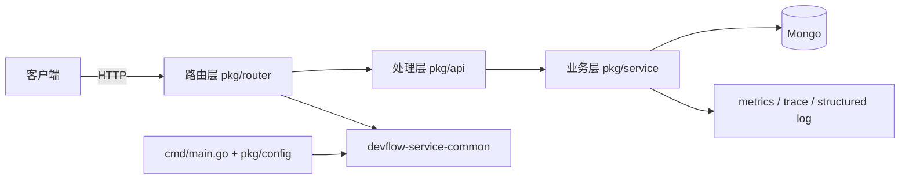

# Devflow 文档（Codex）

## 概述

`devflow-config-service` 是 Devflow 的配置元数据服务，只负责 `Configuration` 资源。

## 启动协议

进入当前仓库后，默认先加载 3 角色 Harness：

- `Planner`
- `Generator`
- `Evaluator`

读取顺序：

- 根目录 `AGENTS.md`
- `agents/README.md`
- `agents/manifest.yaml`
- `agents/protocols/startup.md`

要求：

- 运行时支持 delegation 时，必须真实创建 3 个 sub-agent
- 不支持 delegation 时，也不能省略 spec / contract / handoff / evaluator 结论
- 非简单需求必须先创建 `agents/runs/YYYYMMDD-<slug>/`

## 架构图

## 当前边界

- `Configuration` 是唯一对外资源
- 不再提供 `Project`、`Application`、`Manifest`、`Job`、`Intent`、`Verify`
- `cmd/main.go`、`pkg/router`、`pkg/api`、`pkg/service`、`pkg/model` 只保留 configuration 相关逻辑

## 典型请求流程

1. 客户端发起 HTTP 请求。
2. `pkg/router` 分发到 `pkg/api`。
3. `pkg/api` 解析请求并调用 `pkg/service`。
4. `pkg/service` 访问 Mongo 并返回结果。
5. 若发生出站调用，则必须同时打 `metrics + trace + structured log`。

## 常用命令

- `go run ./cmd`
- `go test ./...`
- `swag init -g cmd/main.go --parseDependency`
